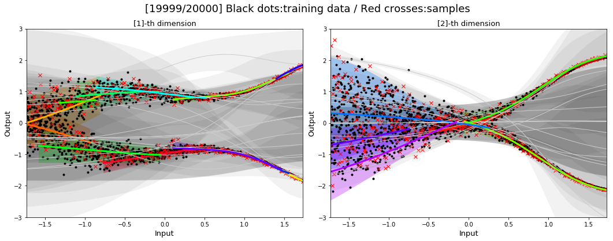
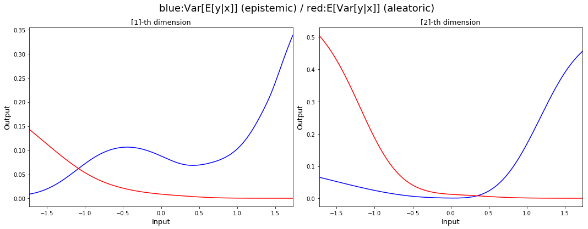

# Density modeling with TensorFlow

We implement two density modeling methods:
1. Unsupervised Gaussian mixture model (GMM): [notebook](https://github.com/sjchoi86/density_network/blob/master/src/demo_fit_MoG.ipynb)
2. Mixture density network (MDN): [notebook](https://github.com/sjchoi86/density_network/blob/master/src/demo_mdn_reg.ipynb)

Among with basic functionalities to train and sample, our mixture density network implementation is able to compute epistemic and aleatoric uncertainties of the prediction in our [paper](https://arxiv.org/abs/1709.02249). 

Black dots and red crosses indicate training data and sampled outputs from the MDN, respectively. We can see that the MDN successfully model the given training data. 
Each mixture whose mixture probability is bigger than certain theshold is shown with colors and mixtures with small mixture probabilities are shown with gray colors. **Isn't the colors beutiful?**

Red and blue curves correspond to aleatoric and epistemic uncertainties of the prediction, respectively, where the aleatoric uncertainty models measurement noise and the epistemic uncertainty models the inconsistencies in the training dataset. As the level of (Gaussian) noise decreases as the input increases, the red curve decreases as input increases. On the contrary, the blue curve increases as input increases as the training data are collected from two different functions whose discrepancy increases as input increases. 

We use `tf.contrib.distributions` to implement the computational graphs which supports `Categorical`, `MultivariateNormalDiag`, `Normal`, and the most important `Mixture`. `tf.contrib.distributions.Mixture` [api](https://www.tensorflow.org/api_docs/python/tf/contrib/distributions/Mixture) provides a number of useful apis such as `cdf`, `cross_entropy`, `entropy_lower_bound`, `kl_divergence`, `log_prob`, `prob`, `quantile`, and `sample`. 

#### Contact: Sungjoon Choi (sungjoon.s.choi@gmail.com)
